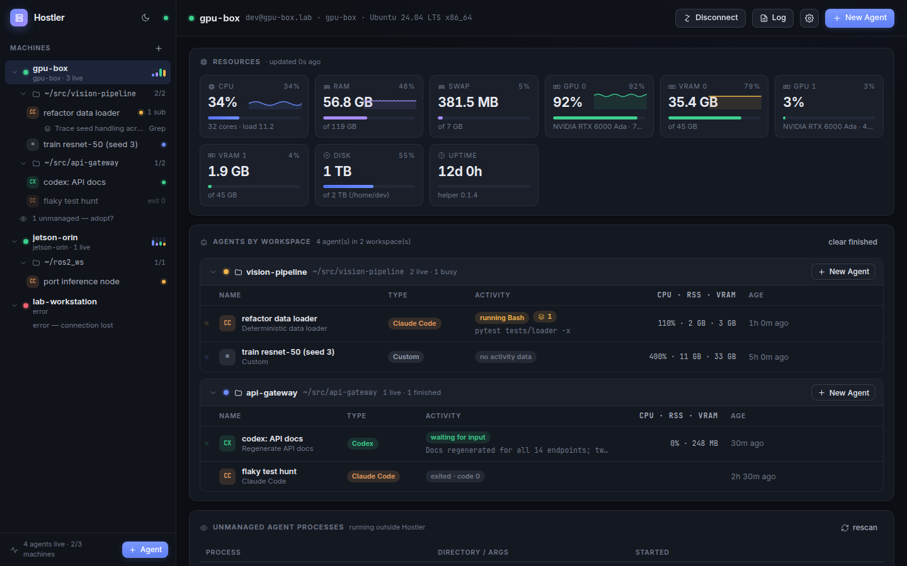
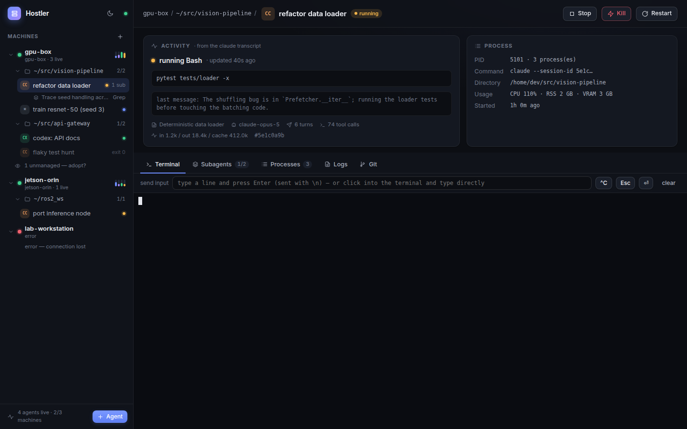
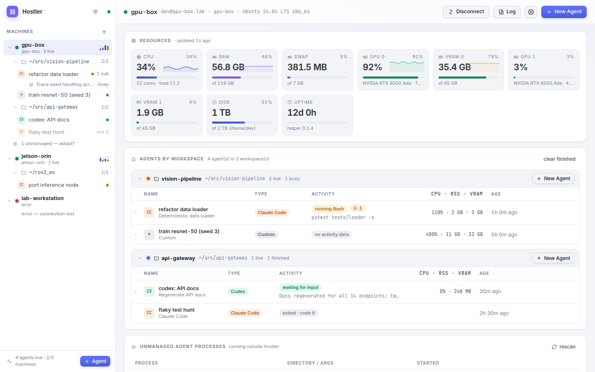

<p align="center">
  
</p>

<h1 align="center">Hostler</h1>

<p align="center">
  <b>An SSH control center for native coding agents.</b><br>
  Run the real Claude Code / Codex / OpenCode CLIs on your servers, workstations and Jetsons — and see, from one window,
  which agents are running, what their subagents are doing, and which processes they started.
</p>

<p align="center">
  <a href="https://github.com/zhehanli66/hostler/actions/workflows/ci.yml"></a>
  <a href="LICENSE"></a>
  
  
</p>

---

Hostler is *not* another AI IDE or agent framework. Think **Docker Desktop for coding agents**: your laptop is the control
plane, the machines you SSH into are the execution plane, and the agents stay exactly what they are — native CLIs with
their own subscription, auth, MCP servers, config and permission prompts. Hostler never proxies model traffic.

```
Machine  →  Workspace (a directory)  →  Agent (persistent PTY)  →  Subagent  →  Process
```

## Highlights

- **Add Machine → pick a directory → New Agent.** Hosts come from `~/.ssh/config` (IdentityFile, ProxyJump) or an address.
- **Agents survive everything.** A tiny stdlib-only Python helper is deployed to `~/.hostler/` on each machine and keeps
  PTYs alive when the GUI closes, the SSH link drops or your laptop sleeps. Reconnect and the terminal is right where it was.
- **See inside the agents.** Status (thinking / running `Bash: pytest …` / waiting for input), the current tool and its
  argument, every subagent and *its* current tool, token usage and session title — read from the agents' own transcripts.
- **Know what they launched.** Per-agent process tree with CPU / RSS / VRAM. `nohup … &` and `setsid` jobs stay attributed
  (the helper is a Linux child-subreaper and tags sessions through the environment).
- **Adopt what's already running.** Discover Claude/Codex/OpenCode processes started elsewhere and manage them in one click
  (activity, processes, signals; terminal when they live in tmux).
- **Native terminal** (xterm.js) plus one-line input, `^C`, `Esc`; **Stop / Kill / Restart** (Claude Code restarts with
  `--resume`); **Git status & diff** per workspace; **CPU / RAM / GPU / VRAM** per machine (NVIDIA via `nvidia-smi`, Jetson via sysfs).
- **Light and dark** themes, desktop app (Electron) or headless control plane + any browser.

<p align="center">
  
</p>

## Quick start

Requirements: Node ≥ 18 on the control machine; Linux with `python3` (3.6+) on each execution machine; SSH access.

```bash
git clone https://github.com/zhehanli66/hostler.git && cd hostler
./bin/hostler            # desktop window — installs deps and builds on first run
./bin/hostler --web      # no Electron: control plane + opens the UI in your browser
./bin/hostler --dev      # hot-reload development mode
```

Then **Add Machine** (or use *This computer* for a local try-out), choose a directory and click **New Agent**.
Want to explore the UI without any server? `npm run demo` starts the control plane with synthetic machines.

Prebuilt desktop packages are produced by the release workflow for macOS, Linux (AppImage/deb) and Windows;
`npm run dist` builds one for the current platform into `release/`.

<p align="center">
  
</p>

## How it works

```
┌──────────── control plane (your computer) ─────────────┐        ┌──────────── execution machine ───────────┐
│  Electron / browser UI  ⇄  Node control plane (ws)     │  ssh   │  ~/.hostler/hostler_helper.py  (daemon)   │
│   · machines & workspaces  (~/.config/hostler)         │ ─────▶ │   · unix socket, JSON-lines RPC           │
│   · ssh2 client, helper deploy/upgrade, reconnect      │ stream │   · PTY sessions: claude / codex / opencode│
│   · fan-out of terminal output to UI clients           │ local  │   · subreaper + /proc scan + nvidia-smi   │
└────────────────────────────────────────────────────────┘ forward│   · transcript introspection              │
                                                                  └────────────────────────────────────────────┘
```

- **Transport.** The control plane reaches the helper's unix socket through SSH streamlocal forwarding (falls back to an
  exec'd stdio relay). No ports are opened on the remote.
- **Sessions** run under your login shell (`$SHELL -lic 'exec claude …'`), so PATH, nvm, auth and MCP config are exactly
  what you get in a normal terminal. Scrollback is kept in memory (1 MB) and on disk (`~/.hostler/logs/`, rotated).
- **Introspection** tails the agents' own session files — Claude Code `~/.claude/projects/<cwd>/<session>.jsonl` and
  `subagents/`, Codex `~/.codex/sessions/**/rollout-*.jsonl` (subagent threads via `parent_thread_id`), OpenCode
  `~/.local/share/opencode/storage` — and normalises them into one activity model.
- **Upgrades.** The helper is re-uploaded whenever its content hash changes and restarted as soon as no session is running
  (PTYs cannot survive a helper restart, so Hostler never restarts it under a live agent).

## Security & credentials

- Key-based SSH is the default path: ssh-agent, `IdentityFile` from `~/.ssh/config`, or the usual `~/.ssh/id_*` keys.
- Password logins are kept **in memory** only. The desktop app can *remember* a password encrypted with the OS keychain
  (Electron `safeStorage`); plain-text passwords are never written to disk, never sent to the UI, never sent to a helper.
- After a password login, **Set up key login** installs your public key on the machine (like `ssh-copy-id`, generating an
  ed25519 key if you have none), verifies key auth and forgets the password.
- The control plane binds `127.0.0.1` and requires a token; host keys are pinned on first use. See [SECURITY.md](SECURITY.md).

## Configuration

| Where | What |
|---|---|
| `~/.config/hostler/config.json` | machines, workspaces (secrets only as keychain ciphertext) |
| `~/.config/hostler/token` | websocket token for the local UI |
| `~/.config/hostler/known_hosts.json` | pinned SSH host keys |
| `~/.hostler/` (remote) | helper, socket, `helper.log`, per-session `logs/<id>.log` |

Environment: `HOSTLER_PORT` (default 7788), `HOSTLER_CONFIG_DIR`, `HOSTLER_NO_AUTH=1` (dev only), `HOSTLER_DEMO=1`,
`HOSTLER_DIR` (remote helper dir, default `~/.hostler`).

Helper CLI on a machine: `python3 ~/.hostler/hostler_helper.py start|stop|status|ensure|version`.

## Development & tests

```bash
npm run typecheck
python3 helper/test_introspect.py           # transcript parsers on synthetic Claude/Codex/OpenCode fixtures
python3 helper/test_helper.py               # isolated helper: PTY I/O, process attribution, restart, git, fs, discovery
npm run build:server && node test/e2e.mjs localhost   # control plane + local + SSH machine over the ws protocol
node test/auth.mjs localhost                # auth failure → prompt, encrypted secrets, ssh-copy-id flow
```

CI runs the whole suite on Ubuntu with an sshd on `localhost` ([ci.yml](.github/workflows/ci.yml)); tags `v*` build
desktop packages for the three platforms ([release.yml](.github/workflows/release.yml)). See [CONTRIBUTING.md](CONTRIBUTING.md).

## Limitations & roadmap

- Execution machines must be Linux (the helper reads `/proc`). The control plane runs anywhere Node runs.
- Adopted processes have no terminal unless they run inside tmux.
- OpenCode introspection follows its on-disk storage layout on a best-effort basis.
- If your distro kills user processes at logout, run `loginctl enable-linger $USER` on the machine.
- Ideas: cross-machine project groups, notifications when an agent is waiting for input, cost/token dashboards.

## License

[MIT](LICENSE)
